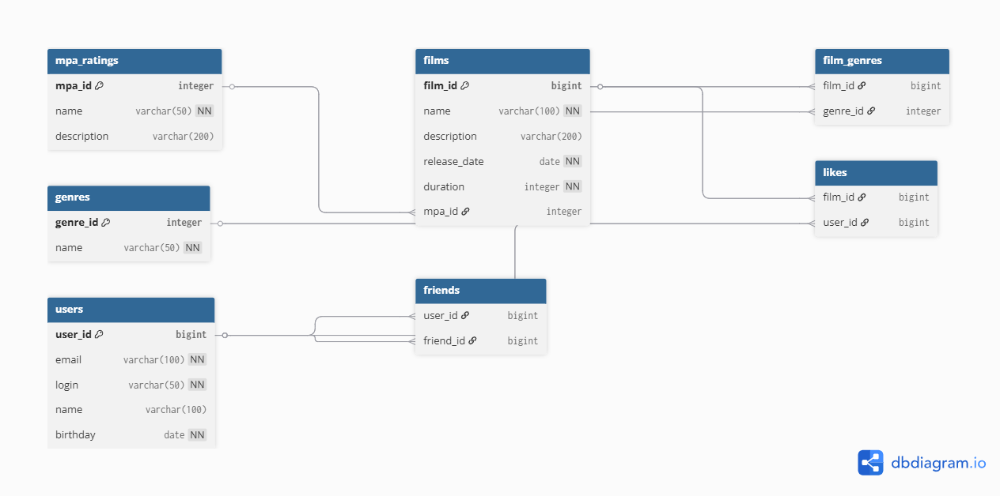

# Filmorate Project

## Database Schema



*Рисунок 1. Схема базы данных Filmorate*


## Структура базы данных

Основные таблицы:
- `users` - хранит данные пользователей
- `films` - содержит информацию о фильмах
- `mpa_ratings` - справочник возрастных рейтингов (G, PG, PG-13, R, NC-17)
- `genres` - справочник жанров фильмов
- `friends` - связи дружбы между пользователями
- `likes` - лайки фильмов от пользователей
- `film_genres` - связь фильмов с жанрами

## Примеры SQL-запросов

### 1. Пользователи
```sql
-- Создание пользователя
INSERT INTO users (email, login, name, birthday) 
VALUES ('user@example.com', 'login', 'User Name', '1990-01-01');

-- Получение списка друзей
SELECT u.* FROM users u
JOIN friends f ON u.user_id = f.friend_id
WHERE f.user_id = 1;
```

### 2. Фильмы
```sql
-- Добавление фильма
INSERT INTO films (name, description, release_date, duration, mpa_id)
VALUES ('Film Name', 'Description', '2000-01-01', 120, 3);

-- Топ-10 популярных фильмов
SELECT f.*, COUNT(l.user_id) AS likes_count FROM films f
LEFT JOIN likes l ON f.film_id = l.film_id
GROUP BY f.film_id
ORDER BY likes_count DESC
LIMIT 10;
```

### 3. Друзья и лайки
```sql
-- Добавление в друзья
INSERT INTO friends (user_id, friend_id) VALUES (1, 2);

-- Добавление лайка фильму
INSERT INTO likes (film_id, user_id) VALUES (1, 1);
```